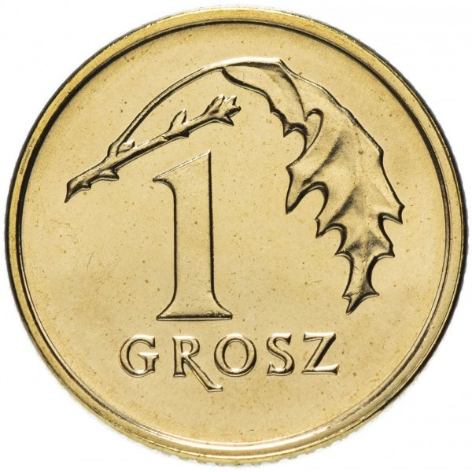

<div align="center">

# 🪙 Grosz

### Visual Identity & Branding Assets Repository



**Logo Variants • Project Artwork • Versioned Branding Assets**


</div>

---

## 🎨 About

**Grosz** is a versioned repository for the visual identity and artwork associated with the Grosz project. In its current form, it serves as a clean home for logo variants and project graphics rather than an application or source-code repository.

This README intentionally describes only the material that is actually present in the repository.

---

## 📦 Assets

| File | Purpose |
|---|---|
| `logo.jpg` | Primary visual asset |
| `logo2.jpg` | Additional artwork / logo variant |
| `logo3.jpg` | Alternative logo / branding variant |

---

## 🧩 Repository Structure

```text
Grosz/
├── logo.jpg
├── logo2.jpg
├── logo3.jpg
└── README.md
```

---

## ℹ️ Project Status

The repository currently contains **visual assets only**. There is no application source code, wallet software or executable package stored here at this time.

---

## 🔍 Discoverability

`grosz project` • `grosz logo` • `grosz branding` • `crypto project artwork` • `token logo assets` • `project visual identity` • `github branding assets`

---

## 👨‍💻 Maintainer

Maintained by **Swir** — [@Swir](https://github.com/Swir)

<div align="center">

### 🪙 A versioned home for the Grosz visual identity

⭐ **Star the repository if you follow the project!**

</div>
