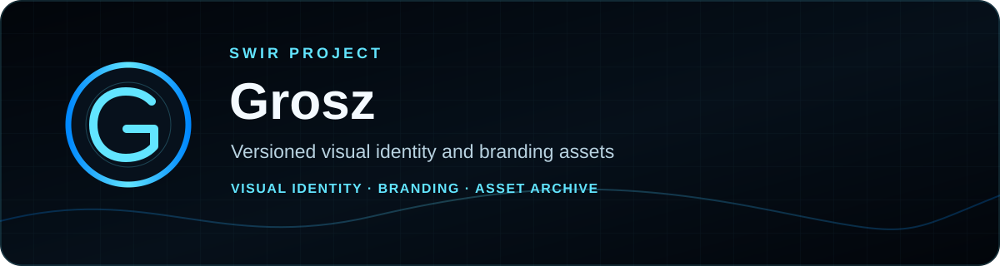
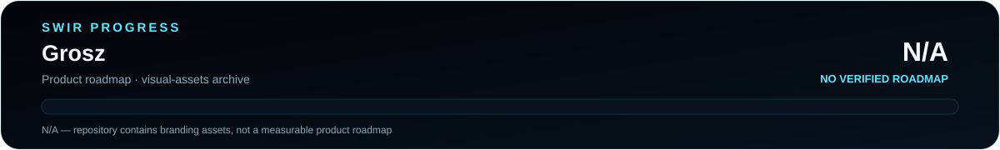

<!-- SWIR-README-STANDARD:v2 -->

<div align="center">



<br>


[](https://github.com/Swir)
[](https://github.com/Swir/Grosz/stargazers)

</div>

**Grosz** is a versioned repository for the visual identity and artwork associated with the Grosz project. Its current contents are branding assets only; it does not contain application, wallet or executable source code.

## 📍 Repository Status



**Product progress:** **N/A** — this repository is an asset archive and has no authoritative product roadmap or measurable application scope.

| Item | Status |
|---|---|
| Repository role | Visual identity / branding archive |
| Application source | Not present |
| Public releases | None |
| Product roadmap | Not present |

## 🎨 Overview

The repository currently keeps three image assets under version control. This README intentionally describes only what is present and does not infer cryptocurrency, wallet, token or application capabilities from the project name or artwork.


## ✨ Assets

| File | Repository role |
|---|---|
| `logo.jpg` | Primary visual asset |
| `logo2.jpg` | Additional artwork / logo variant |
| `logo3.jpg` | Alternative branding variant shown in this README |

`logo.jpg` and `logo2.jpg` currently reference identical stored content; both filenames are preserved as part of the existing asset set.

## ⚙️ Using the Assets

Clone the repository when you need the versioned image files:

```bash
git clone https://github.com/Swir/Grosz.git
cd Grosz
```

No installation step, runtime dependency or executable is required because this repository currently contains no application code.

## 🧩 Repository Structure

```text
Grosz/
├── logo.jpg
├── logo2.jpg
├── logo3.jpg
└── README.md
```

## 🗺️ Roadmap / Progress


**Measured scope:** product roadmap · **Progress:** N/A · **Counter:** N/A.

No canonical roadmap exists for this asset-only repository, so release count, file count and documentation state are not converted into an invented completion percentage.

## 📦 Releases

There are currently **no GitHub Releases** for this repository. The tracked branding files are available directly from the repository history.

## ⚠️ Scope / Limitations

- This repository is a visual-assets archive, not a functioning software product.
- No wallet, network, payment, token-management or executable functionality is present in the current repository.
- The three tracked JPEG files are the authoritative repository content described here; no additional product claims are implied.

## 🔎 Search Keywords

`grosz project` • `grosz logo` • `grosz branding` • `visual identity assets` • `project branding archive` • `github logo repository` • `versioned artwork assets` • `brand image variants` • `project visual identity` • `branding asset repository`

<div align="center">

### `IDENTITY • ASSETS • HISTORY • BRAND`

[**← SWIR profile**](https://github.com/Swir) · [**All projects →**](https://github.com/Swir?tab=repositories)

</div>
